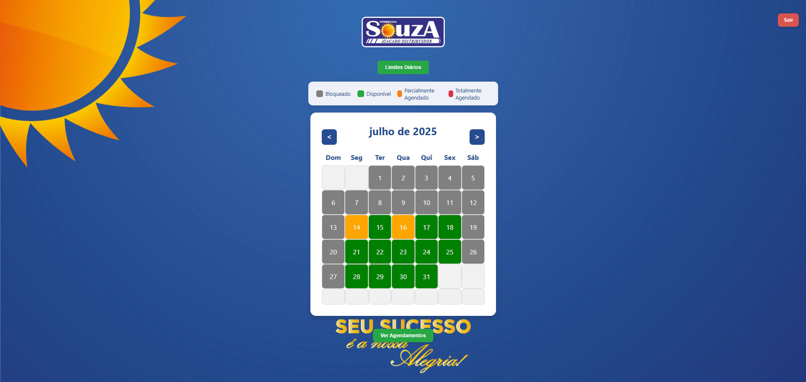
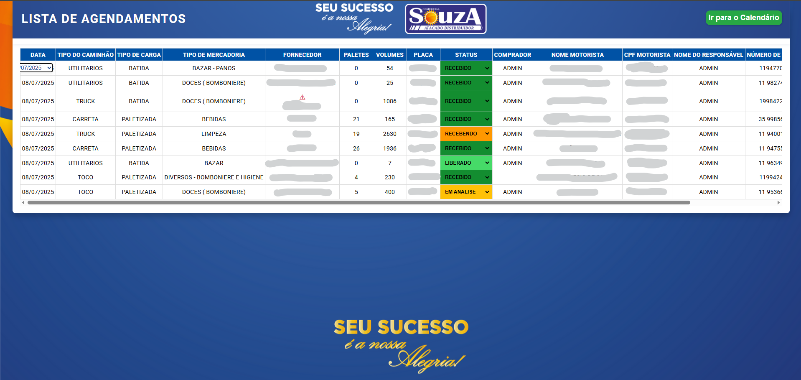
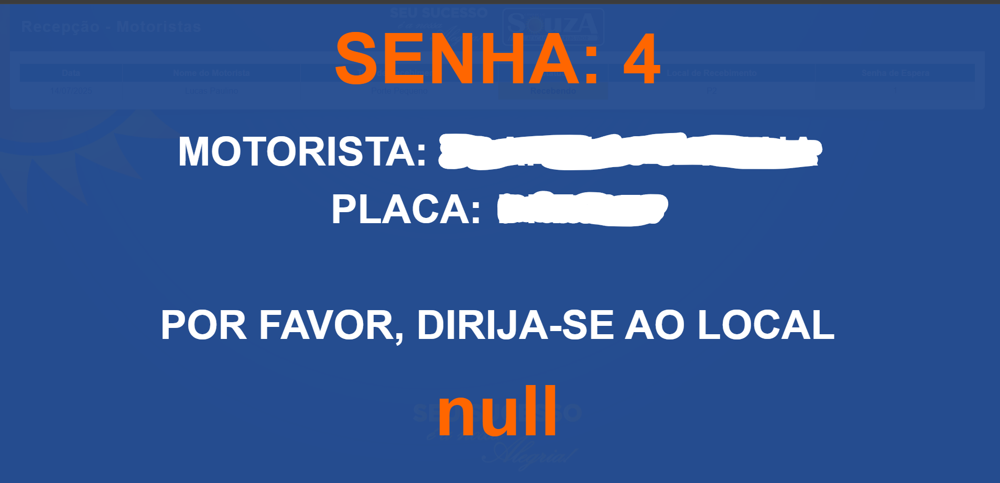
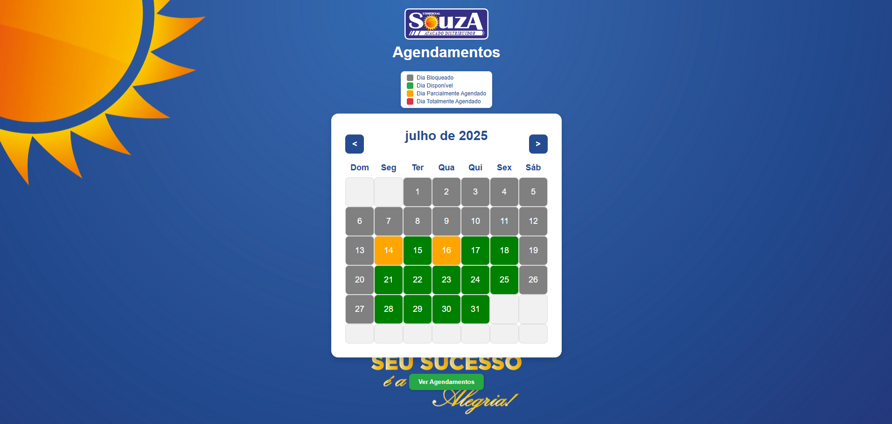

# 📦 Sistema de Agendamento de Cargas - Comercial Souza

[]()
[]()
[]()
[]()

---

## 📝 Descrição

Sistema web para **agendamento de recebimento de cargas** com controle completo de conferência, recepção e visualizações administrativas.  

Desenvolvido para uso interno no **Souza Atacado Distribuidor**, este sistema garante controle de fluxo logístico, segurança na triagem e visibilidade total dos agendamentos.

---

## 🔧 Funcionalidades Principais

✅ Calendário com dias disponíveis para agendamento  
✅ Controle por status (agendado, liberado, recebido, conferido)  
✅ Painel de chamadas para recepção  
✅ Registro e controle de conferência  
✅ Visualizações internas e públicas separadas  
✅ Interface multiusuário com permissões básicas  
✅ Logs de operação e chamadas de motorista  
✅ Configuração de horários e dias disponíveis  
✅ Totalmente em PHP + MySQL + JS

---

## 📁 Estrutura do Projeto

```
recebimento/
├── css/                            # Estilos do sistema
├── img/                            # Imagens (logo, fundos, ícones)
├── js/                             # Scripts JS (eventos, interações)
├── db.php                          # Conexão com o banco MySQL

├── login.php                       # Tela de login
├── valida_login.php               # Validação de usuário
├── logout.php                     # Logout do sistema

├── pagina-principal.php           # Calendário de agendamentos
├── processar_agendamento.php      # Processamento de agendamentos
├── editar-agendamento.php         # Edição de agendamento

├── gerenciamento-calendario.php   # Gerenciamento de dias úteis
├── obter_dias_status.php          # Consulta status de dias
├── verificar_dias.php             # Verifica disponibilidade
├── atualizar_status.php           # Atualiza status dos dias

├── visao-agendamentos.php         # Visualização interna
├── visao-agendamentos-publico.php # Visualização pública
├── visao-recepcao.php             # Visualização da recepção
├── visao-recebimento.php          # Tela para recebimento e registro de entrada

├── chamar_motorista.php           # Chamada do motorista
├── painel-senhas.php              # Painel de senha chamado

├── registrar_conferencia.php      # Registro da conferência
├── get_conferencia.php            # Consulta conferência

├── salvar-visita.php              # Registro de visitas externas
├── pagina-publica.php             # Página externa institucional

├── atualizar_local_recebimento.php # Atualiza local de entrega
├── verificar_chamada.php          # Consulta chamada
├── verificar_disponibilidade.php  # Disponibilidade por horário

├── ver-agendamentos-publico.php   # Visualização pública alternativa
├── teste.php, debug_post.txt, log_status.txt # Logs e testes
```

---

## 🛠️ Como Executar (Ambiente Local)

1. Instale o [XAMPP](https://www.apachefriends.org/index.html)
2. Copie a pasta `recebimento/` para `C:/xampp/htdocs/`
3. Inicie o Apache e o MySQL pelo painel do XAMPP
4. Crie o banco de dados `recebimento` no **phpMyAdmin**
5. Importe o arquivo `.sql` com a estrutura do banco
6. Acesse no navegador:
```
http://localhost/recebimento/login.php
```

---

## 🔐 Usuários e Permissões

- Usuários definidos no `valida_login.php`
- Controle de permissões feito por tipo de usuário
- O sistema diferencia visualizações públicas e privadas

---

## 📸 Capturas de tela e explicações

> As imagens a seguir ilustram as funcionalidades do sistema.

### 1. 🔐 Login (`login.php`)
Tela de autenticação com controle por tipo de perfil.  


### 2. 📅 Calendário de Agendamentos (`pagina-principal.php`)
Interface com dias disponíveis, bloqueados e modal de agendamento.  


### 3. 🗂️ Visualização de Agendamentos (`visao-agendamentos.php`)
Área interna para consulta de todos os agendamentos cadastrados.  


### 4. 🧾 Visualização de Recebimento (`visao-recebimento.php`)
Permite registro e liberação das cargas que chegam no dia.  


### 5. 🛎️ Painel da Recepção (`visao-recepcao.php`)
Mostra agendamentos do dia com botão de chamada e conferência.  


### 6. 🌐 Página Pública (`pagina-publica.php`)
Apresenta informações e acesso ao módulo público.  


### 7. 👁️ Ver Agendamentos Públicos (`pagina-publica.php`)
Permite qualquer visitante consultar dias agendados/livres.  


### 8. 👁️ Ver Agendamentos Públicos (`visao-agendamentos-publico.php`)
Permite qualquer visitante consultar os agendamentos que ele mesmo fez.  


---

## 👨‍💻 Autor

**Matheus Cabral**  
Sistema desenvolvido para uso interno da operação logística do Souza Atacado Distribuidor.  

---

## 🤝 Colaboradores

**Alexandre Rodrigues** – Contribuições no layout e experiência visual

---

## 📄 Licença

Projeto de uso interno.  
Livre para adaptar conforme a necessidade da empresa.
